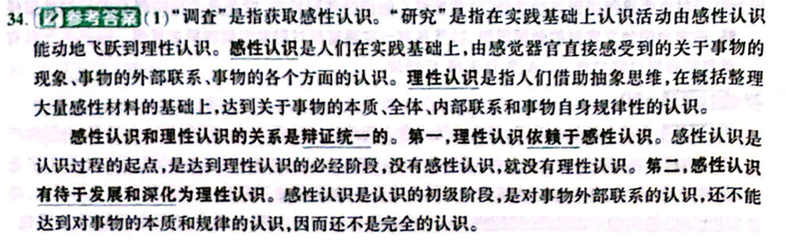
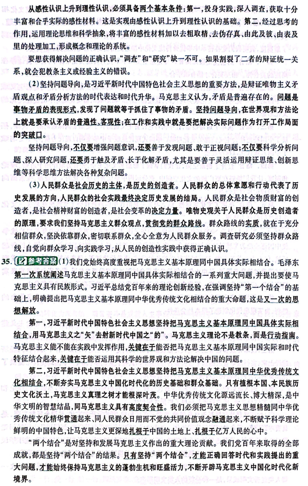
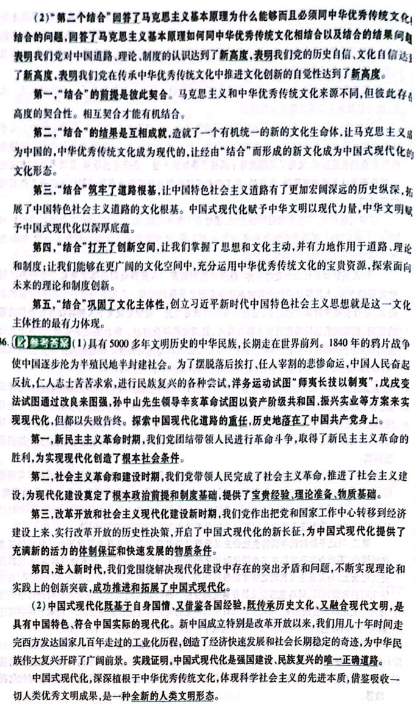
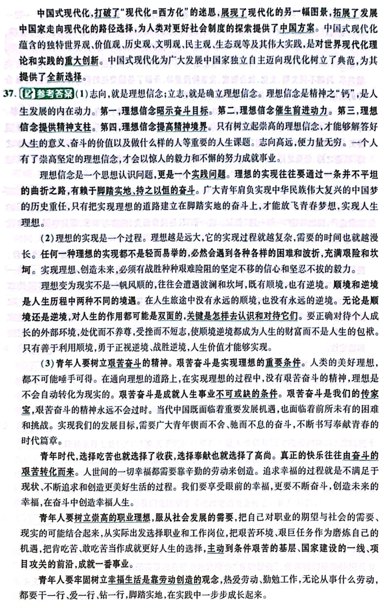
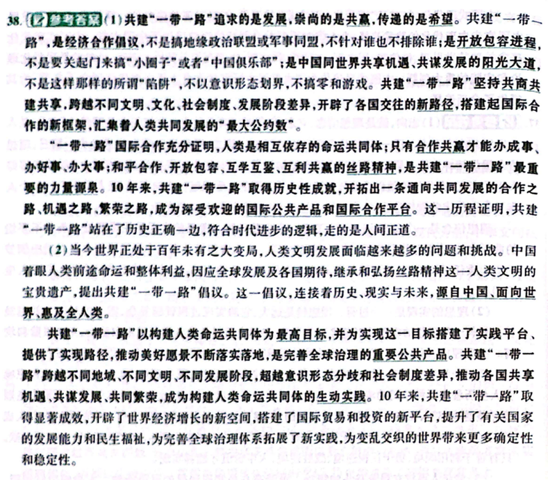

**《中国特色社会主义进入新时代》**

**一、社会主要矛盾的转化**

新中国成立特别是改革开放以来，我国社会主义现代化建设取得了重大成就，深刻改变了我国社会的基本面貌。党的十九大提出，我国社会主要矛盾已经转化为人民日益增长的美好生活需要和不平衡不充分的发展之间的矛盾。这一重大判断，丰富和发展了马克思主义矛盾学说，为深刻把握中国特色社会主义进入新时代和新发展阶段提供了重要依据。

**二、中国特色社会主义进入新时代的内涵和意义**

中国特色社会主义进入新时代，具有丰富的内涵和重大的意义。新时代是中国特色社会主义新时代，具有以下特征：

1. **新时代的丰富内涵**：新时代是承前启后、继往开来、在新的历史条件下继续夺取中国特色社会主义伟大胜利的时代；是我国日益走近世界舞台中央、不断为人类作出更大贡献的时代；是全国各族人民团结奋斗、不断创造美好生活、逐步实现全体人民共同富裕的时代；是全体中华儿女勠力同心、奋力实现中华民族伟大复兴中国梦的时代；是决胜全面建成小康社会、进而全面建设社会主义现代化强国的时代。
2. **新时代的鲜明特征**：社会主要矛盾发生新变化；党的理论创新实现新飞跃；党和人民事业确立新目标；中国和世界关系开创新局面；中国共产党展现新面貌。
3. **新时代的重大意义**：意味着中国特色社会主义道路、理论、制度、文化不断发展，拓展了发展中国家走向现代化的途径，给世界上那些既希望加快发展又希望保持自身独立性的国家和民族提供了全新选择，为解决人类问题贡献了中国智慧和中国方案。

**三、新发展阶段和社会主义现代化强国建设**

1. **新发展阶段的内涵和依据**：新发展阶段是全面建设社会主义现代化国家、向第二个百年奋斗目标进军的阶段，是我们党带领人民迎来从站起来、富起来到强起来历史性跨越的新阶段，是我国社会主义发展进程中的一个重要阶段。
2. **新发展阶段的新机遇新挑战**：当前和今后一个时期，虽然我国发展仍然处于重要战略机遇期，但机遇和挑战都有新的发展变化，机遇和挑战之大都前所未有，总体上机遇大于挑战。
3. **社会主义现代化强国建设的战略安排**：从全面建成小康社会到基本实现现代化，再到全面建成社会主义现代化强国，是新时代中国特色社会主义发展的战略安排。对实现第二个百年奋斗目标作出分两个阶段推进的战略安排，是新形势下党对我国社会主义现代化建设“三步走”总体战略的推进和发展。

**四、实践要求**

1. **正确处理“变”与两个“不变”的关系**：我国仍处于并将长期处于社会主义初级阶段的基本国情没有变，我国是世界最大发展中国家的国际地位没有变。
2. **坚持以人民为中心的发展思想**：强调要“坚持人民主体地位，坚持共同富裕方向，始终做到发展为了人民、发展依靠人民、发展成果由人民共享”。
3. **从全局的高度思考和谋划党和国家工作**：胸怀“两个大局”，具体落实到各个领域、各个方面、各项工作中去。

**五、课后思考**

1. **为什么说社会主要矛盾的转化是关系全局的历史性变化？**

   从马克思主义的立场来看，社会主要矛盾的转化是社会发展阶段性特征的体现，它反映了社会生产力发展和人民需求变化的新特点。社会主要矛盾的转化意味着党和国家的工作重心、政策导向、发展战略等都需要相应调整，以适应新的发展要求。这种转化是关系全局的，因为它涉及到经济、政治、文化、社会等各个方面，对国家的发展方向和政策制定具有决定性影响。个人体会上，我认为社会主要矛盾的转化要求我们更加关注发展的质量和效益，更加注重解决发展不平衡不充分的问题，以满足人民日益增长的美好生活需要。

2. **结合当前我国社会主要矛盾的变化，如何理解新时代青年的责任与担当？**

   新时代青年生逢其时，肩负着推动社会发展和实现民族复兴的历史使命。当前我国社会主要矛盾的变化要求青年一代要积极投身于社会主义现代化建设，特别是在科技创新、文化传承、生态保护等领域发挥重要作用。青年要勇于担当，敢于创新，不断提高自身素质，为解决发展不平衡不充分的问题贡献智慧和力量。个人体会上，我认为新时代青年应该树立远大理想，坚持正确价值观，积极学习新知识、新技能，以实际行动参与到国家的发展中去。

3. **中国特色社会主义进新时代，新在哪里？**

   中国特色社会主义进入新时代，新在社会主要矛盾的变化、党的理论创新的新飞跃、党和人民事业的新目标、中国和世界关系的新局面、中国共产党的新面貌。这些新变化体现了我国在经济、政治、文化、社会和生态文明建设等方面的全面进步。从马克思主义的观点看，这些新变化是社会生产力发展和社会关系变革的必然结果，是社会主义发展规律的体现。个人体会上，我认为新时代的“新”不仅仅是时间概念上的新，更是发展理念、发展方式、发展目标上的新，它要求我们以新的思路、新的方法去解决新的问题。

4. **如何做社会主义初级阶段的“变”与“不变”中理解新发展阶段？**

   在社会主义初级阶段的“变”与“不变”中理解新发展阶段，需要把握以下几点：首先，坚持社会主义初级阶段的基本国情没有变，这是我们制定一切方针政策的根本出发点；其次，适应社会主要矛盾的变化，调整发展策略，更加注重发展的质量和效益；再次，推动高质量发展，实现经济、政治、文化、社会和生态文明建设的全面进步。个人体会上，我认为在“变”与“不变”中理解新发展阶段，就是要在坚持基本原则的同时，不断适应新情况、解决新问题，推动社会主义现代化建设不断取得新成就。

5. **如何深入把握新发展阶段与社会主义现代化强国建设的关系？**

   新发展阶段是社会主义现代化强国建设的阶段性目标和必经过程。深入把握这两者的关系，需要做到：明确战略目标，新发展阶段的目标是全面建设社会主义现代化国家；坚持战略安排，按照“两步走”战略安排，分阶段推进社会主义现代化建设；应对新机遇新挑战，以辩证思维看待新发展阶段的新机遇新挑战，勇于开顶风船，善于转危为机。个人体会上，我认为新发展阶段与社会主义现代化强国建设的关系是密切联系、相互促进的，新发展阶段为社会主义现代化强国建设奠定了坚实基础，而社会主义现代化强国建设又为新发展阶段提供了明确的目标和方向。

**《新时代坚持和发展中国特色社会主义》**

**一、当代中国发展进步的根本方向**

1. **历史的结论、人民的选择**
    中国特色社会主义是党和人民历经千辛万苦、付出巨大代价取得的根本成就。它不是从天上掉下来的，而是在世界社会主义500多年的发展历程中，经过中国共产党成立100年来的实践，中华人民共和国成立70多年的持续探索，改革开放40多年的伟大实践中得来的。
2. **中国特色社会主义走得对、走得通、走得好**
    中国特色社会主义经过实践的检验，创造了世所罕见的经济快速发展奇迹和社会长期稳定奇迹。它使中国在短短几十年里摆脱贫困，跃升为世界第二大经济体，创造了人类社会发展史上的发展奇迹。
3. **坚定道路自信、理论自信、制度自信、文化自信**
    中国特色社会主义道路是实现社会主义现代化和创造人民美好生活的必由之路；理论体系是实现中华民族伟大复兴的正确理论；制度是当代中国发展进步的根本制度保障；文化是激励全党全国各族人民奋勇前进的强大精神力量。

**二、新时代坚持和发展中国特色社会主义的奋斗目标**

1. **中国共产党的初心和使命**
    中国共产党的初心和使命是为中国人民谋幸福，为中华民族谋复兴。这个初心和使命是激励中国共产党人不断前进的根本动力。
2. **实现中华民族伟大复兴的中国梦**
    中国梦是国家富强、民族振兴、人民幸福的梦。它归根结底是人民的梦，是让全体中国人都过上更好的日子。
3. **在推进“四个伟大”中勇担历史使命**
    “四个伟大”紧密联系、相互贯通、相互作用，其中起决定性作用的是党的建设新的伟大工程。实现中华民族伟大复兴需要进行伟大斗争、建设伟大工程、推进伟大事业、实现伟大梦想。

**三、谱写新时代中国特色社会主义新篇章**

1. **统筹推进“五位一体”总体布局**
    统筹推进经济建设、政治建设、文化建设、社会建设、生态文明建设，形成全面发展的新格局。
2. **协调推进“四个全面”战略布局**
    协调推进全面建设社会主义现代化国家、全面深化改革、全面依法治国、全面从严治党的战略布局，确保党和国家事业始终沿着正确方向前进。
3. **牢牢把握“三个一以贯之”的重大要求**
    坚持和发展中国特色社会主义要一以贯之，推进党的建设新的伟大工程要一以贯之，增强忧患意识、防范风险挑战要一以贯之，确保党和国家长期稳定发展。

**小结**

中国特色社会主义是科学社会主义在中国的实践与发展，它不是简单延续历史文化的“母版”，也不是其他国家社会主义实践的“再版”，更不是国外现代化发展的“翻版”。它是根植于中国大地、反映中国人民意愿、适应中国和时代发展进步要求的科学社会主义。新时代的青年必须坚定理想信念，强化使命担当，努力练就过硬本领，在实现中华民族伟大复兴的中国梦的历史进程中不负众望。

**课后思考**

1. **为什么说中国特色社会主义是科学社会主义，而不是其他的什么主义？**

   从马克思主义的立场出发，科学社会主义是建立在唯物史观和剩余价值理论基础上的社会主义理论，它揭示了资本主义社会的内在矛盾和历史发展趋势，指明了无产阶级的历史使命和社会主义的发展方向。中国特色社会主义坚持了科学社会主义的基本原则，如公有制的主体地位、共同富裕的目标、人民民主专政等，同时又根据中国的实际情况和时代特征，赋予其鲜明的中国特色，如改革开放、社会主义市场经济等。这种理论与实践的结合，体现了马克思主义的生命力和开放性，是科学社会主义在中国的具体实践和创新发展。个人体会上，我认为中国特色社会主义的成功实践，证明了马克思主义理论的强大解释力和指导力，也体现了中国共产党将马克思主义基本原理与中国实际相结合的智慧和勇气。

2. **如何理解中国共产党是有初心和使命的新型马克思主义政党？**

   中国共产党作为马克思主义政党，其初心和使命是为中国人民谋幸福，为中华民族谋复兴。这一初心和使命体现了党的性质和宗旨，是党的全部工作和奋斗的出发点和落脚点。从马克思主义的观点看，共产党是最先进阶级的政党，它没有任何自己的私利，始终代表最广大人民的根本利益。中国共产党在百年奋斗历程中，始终不忘初心，牢记使命，不断推进理论创新、实践创新和制度创新，展现出马克思主义政党的先进性和纯洁性。个人体会上，我认为中国共产党的初心和使命是激励我不断前进的精神动力，作为新时代的青年，我深感肩负着历史责任，要为实现中华民族伟大复兴贡献自己的力量。

3. **实现中华民族伟大复兴何以构成中国共产党百年奋斗的主题？**

   实现中华民族伟大复兴是中国共产党的宏伟目标，是党的百年奋斗主题。这一主题体现了中国共产党的历史责任和时代使命，是党的全部工作和奋斗的出发点和落脚点。从马克思主义的方法论出发，实现中华民族伟大复兴需要通过社会革命和自我革命，不断解放和发展生产力，推动社会全面进步。中国共产党在不同历史时期，始终围绕这一主题，团结带领人民进行艰苦卓绝的斗争，取得了一个又一个伟大胜利。个人体会上，我认为实现中华民族伟大复兴不仅是党的历史使命，也是每一个中国人的共同梦想，它激励我要不断学习、不断进步，为实现这一伟大目标贡献自己的智慧和力量。

4. **如何理解“四个全面”战略布局的重大战略意义？**

   “四个全面”战略布局是中国共产党在新时代坚持和发展中国特色社会主义的战略指引，它明确了新时代党和国家各项工作的关键环节和重点领域。从马克思主义的观点看，“四个全面”战略布局体现了辩证唯物主义和历史唯物主义的基本原理，强调了全面建设社会主义现代化国家的目标导向，全面深化改革的动力作用，全面依法治国的法治保障，全面从严治党的政治保证。这一战略布局是实现中华民族伟大复兴中国梦的重要保障，也是推进国家治理体系和治理能力现代化的必然要求。个人体会上，我认为“四个全面”战略布局为新时代中国特色社会主义的发展提供了清晰的路线图和行动指南，它要求我们在实践中不断探索、不断前进，为实现社会主义现代化和中华民族伟大复兴而努力奋斗。

5. **新时代坚持和发展中国特色社会主义为何要牢牢把握“三个一以贯之”的要求？**

   牢牢把握“三个一以贯之”的要求，是为了确保党和国家事业始终沿着正确方向前进，确保党和国家长期稳定发展，确保实现中华民族伟大复兴的中国梦。从马克思主义的立场出发，坚持和发展中国特色社会主义要一以贯之，体现了对科学社会主义基本原则的坚持；推进党的建设新的伟大工程要一以贯之，体现了对党的自我革命和自我完善的要求；增强忧患意识、防范风险挑战要一以贯之，体现了对国内外形势变化的敏锐洞察和科学应对。个人体会上，我认为“三个一以贯之”的要求是新时代坚持和发展中国特色社会主义的重要保证，它要求我们在实践中始终保持清醒的头脑，坚定的信念，不断增强忧患意识，提高防范和抵御风险的能力，为实现党和国家的长期稳定发展贡献力量。

**《以中国式现代化推进中华民族伟大复兴》**

**一、新时代新征程中国共产党的中心任务**

1. **党的二十大报告核心任务**
   - 党的二十大报告明确指出，从现在起，中国共产党的中心任务是团结带领全国各族人民全面建成社会主义现代化强国、实现第二个百年奋斗目标，以中国式现代化全面推进中华民族伟大复兴。
2. **现代化和中国式现代化的基本含义**
   - 现代化是指以工业化为起点的社会全面变革，其结果是形成以现代大工业为基础的现代社会。中国式现代化遵循现代化的一般规律，同时具有基于中国国情的鲜明特色。
3. **中国式现代化提法的由来**
   - 1978年党的十一届三中全会开启了中国式现代化的进程。邓小平同志首次提出“中国式的现代化”，强调社会主义现代化建设必须具有中国特色。党的十八大以来，习近平总书记全面系统地阐述了中国式现代化理论，强调在理论和实践上的创新突破。

**二、在团结奋斗中实现全体人民共同富裕**

1. 共同富裕的内涵
   - 共同富裕是社会主义的本质要求，是中国式现代化的重要特征。它不仅要求经济增长，更要求实现全体人民的共同富裕，承认一定程度的合理差距，通过改革发展让全体人民共享发展成果。

**三、进一步全面深化改革 推进中国式现代化**

1. **党的二十届三中全会精神**
   - 2024年7月15日至18日，中国共产党第二十届中央委员会第三次全体会议在北京召开。全会审议通过了《中共中央关于进一步全面深化改革推进中国式现代化的决定》，高度评价新时代以来全面深化改革的成功实践和伟大成就。
2. **全面深化改革的重大意义和总体要求**
   - 面对国际国内形势和科技革命，必须继续推进改革。改革是坚持和完善中国特色社会主义制度、推进国家治理体系和治理能力现代化的必然要求。
3. **全面深化改革的战略部署**
   - **经济领域：**构建高水平社会主义市场经济体制，推动高质量发展，构建新发展格局。
   - **社会领域：**发展全过程人民民主，加强法治保障，协调物质文明和精神文明发展。
   - **生态领域：**建设美丽中国，加快绿色转型，促进人与自然和谐共生。
   - **政治领域：**提高党的领导水平和执政能力，深化党的建设制度改革。
   - **文化领域：**加强意识形态工作，优化文化服务和产品供给，构建国际传播体系。
   - **民生领域：**保障和改善民生，完善收入分配制度，健全社会保障体系。

**四、提高党对进一步全面深化改革的领导水平**

1. **党中央的集中统一领导**
   - 党中央负责改革的总体设计、统筹协调、整体推进，鼓励各地区各部门结合实际开拓创新。
2. **党的建设制度改革**
   - 完善党的建设制度机制，加强党的创新理论武装，深化干部人事制度改革，提高干部现代化建设能力。
3. **党风廉政建设和反腐败斗争**
   - 保持反腐政治定力，实现不敢腐、不能腐、不想腐一体推进的战略目标。

**小结**

中国式现代化是中国共产党领导下的现代化，是具有中国特色、符合中国国情的现代化。它不仅包括经济的现代化，还包括政治、文化、社会、生态等各方面的现代化。中国式现代化是全面建设社会主义现代化国家、实现中华民族伟大复兴的必由之路。通过全面深化改革，推进中国式现代化，我们能够更好地实现全体人民共同富裕，为全球发展贡献中国智慧和中国方案。

**《新时代中国特色社会主义经济建设》**

**一、新时代中国特色社会主义经济理论与制度**

1. **新时代中国特色社会主义经济理论**
   - **形成背景**：在改革开放实践过程中形成的重要经济理论。
   - 核心内容：
     - 社会主义基本分配制度的理论。
     - 社会主义本质的理论。
     - 经济体制改革的理论。
     - 社会主义市场经济的理论。
     - 社会主义初级阶段基本经济制度的理论。
     - 对外开放的理论。
   - 习近平经济思想：
     - **含义**：以习近平同志为核心的党中央提出的一系列新的重大战略思想和重要理论观点。
     - 主要内容：
       - 坚持正确工作策略和方法的理论。
       - 加强党对经济工作的集中统一领导的理论。
       - 经济发展战略的理论。
       - 坚持以人民为中心的发展的理论。
       - 社会主义市场经济改革的理论。
       - 用新发展理念统领发展全局的理论。
       - 构建新发展格局的理论。
       - 经济发展新常态的理论。
       - 供给侧结构性改革的理论。
       - 推动经济高质量发展的理论。
     - **理论意义**：深化了对共产党执政规律、社会主义建设规律、人类社会发展规律的认识。
     - **实践意义**：为世界社会主义发展和发展中国家实现现代化贡献中国智慧和中国方案。
2. **新时代中国特色社会主义经济制度**
   - **经济制度含义**：体现一定社会中最基本、最本质的经济关系。
   - 主要内容：
     - 社会主义初级阶段的生产资料所有制。
     - 社会主义初级阶段的收入分配制度。
     - 社会主义市场经济体制。
   - **三个基本经济制度之间的关系**：相互联系、相互支持、相互促进。

**二、贯彻新发展理念**

1. **我国经济转向高质量发展阶段**
   - **经济发展新常态**：我国经济已由高速增长阶段转向高质量发展阶段。
   - **推动经济高质量发展**：高质量发展是保持经济持续健康发展的必然要求。
2. **用新发展理念统领发展全局**
   - 新发展理念的丰富内涵：
     - 创新：引领发展的第一动力。
     - 协调：持续健康发展的内在要求。
     - 绿色：永续发展的必要条件。
     - 开放：国家繁荣发展的必由之路。
     - 共享：中国特色社会主义的本质要求。
   - **新发展理念的理论地位**：开辟了我们党发展理论的新境界。
3. **建设现代化经济体系**
   - **必要性**：跨越关口的迫切要求和我国发展的战略目标。
   - **主要内涵**：统一开放、竞争有序的市场体系；充分体现效率、促进公平的收入分配体系等。
   - **主要任务**：积极推动城乡区域协调发展；大力发展实体经济；着力发展开放型经济。

**三、构建新发展格局**

1. **发展格局的根本变化**
   - **新发展格局的内涵**：以国内大循环为主体、国内国际双循环相互促进的新发展格局。
   - **发展格局发生变化的背景**：国际政治经济环境深刻变化，国内社会主要矛盾变化。
2. **把握发展主动权的先手棋**
   - **构建新发展格局的必要性**：增强我国的生存力、竞争力、发展力、持续力。
3. **构建新发展格局的主要工作**
   - **关键在于经济循环的畅通无阻**：深化供给侧结构性改革，实现更高水平和更高质量的供需动态平衡。

**四、深化供给侧结构性改革**

1. **以供给侧结构性改革为主线**
   - **供给侧和需求侧的区别**：供给侧重在解决结构性问题，需求侧重在解决总量性问题。
   - **供给侧结构性改革的提出**：解决实体经济结构性供需失衡、金融和实体经济失衡、房地产和实体经济失衡。
2. **把发展经济的着力点放在实体经济上**
   - **实体经济的内涵和意义**：实体经济是一国经济的立身之本，是国家强盛的重要支柱。
3. **加快建设制造强国**
   - **加快构建制造强国的必要性**：提升我国制造业国际竞争力，推动制造业高质量发展。
4. **支持传统产业优化升级**
   - **传统产业优化升级的手段**：引入新技术、新管理、新模式，焕发传统产业生机和活力。

**五、完善社会主义市场经济体制**

1. **坚持社会主义市场经济改革方向**
   - **市场在资源配置中起决定性作用**：减少政府对资源的直接配置，减少政府对微观经济活动的直接干预。
2. **深化国有企业改革**
   - **国有经济的含义及其作用**：国有经济是国民经济中的主导力量，深化国企改革是完善社会主义市场经济体制的重要内容。
3. **激发市场主体活力**
   - **市场主体的定义**：市场上从事生产和交易活动的组织和个人。
4. **创新和完善宏观调控**
   - **宏观调控的含义和目标**：保持社会总供给与总需求的基本平衡，弥补市场调节不足。

**六、推动形成全面开放新格局**

1. **中国开放的大门只会越开越大**
   - **新时代我国对外开放新形势**：经济全球化深入发展，国际经济合作和竞争格局加速演变。
2. **推动“一带一路”建设**
   - **推进“一带一路”建设的原则和意义**：秉持共商共建共享的原则，打造成为顺应经济全球化潮流的最广泛国际合作平台。
3. **实施高水平对外开放**
   - **主动开放、双向开放、全面开放、公平开放、共赢开放、包容开放**：优化区域开放布局，加大西部开放力度。

**思考题**

1. **社会主义初级阶段基本经济制度的内涵和意义是什么？**

   从马克思主义的立场出发，社会主义初级阶段基本经济制度是适应我国生产力发展不平衡、多层次特点的必然选择。它包括以公有制为主体、多种所有制经济共同发展的基本经济制度，以及按劳分配为主体、多种分配方式并存的分配制度。这一制度的内涵在于，它既坚持了社会主义的基本属性，又充分发挥了市场在资源配置中的决定性作用，体现了社会主义市场经济的特点。个人体会上，我认为这一制度的确立，为我国经济发展提供了强大的动力和广阔的空间，使得我国能够在全球化的大背景下，充分发挥后发优势，实现经济的快速增长和社会的全面进步。

2. **如何理解建设现代化经济体系的内涵及其重要意义？**

   建设现代化经济体系是实现高质量发展的必由之路。马克思主义认为，经济基础决定上层建筑，现代化经济体系的建设是适应新时代我国社会主要矛盾变化的必然要求。它要求我们转变发展方式、优化经济结构、转换增长动力，实现质量变革、效率变革、动力变革。个人体会上，我认为建设现代化经济体系不仅是经济领域的一项系统工程，也是全面深化改革的重要内容，它涉及到经济、政治、文化、社会等多个方面，对于提升国家综合实力和国际竞争力具有重要意义。

3. **为什么要把发展经济的着力点放在实体经济上？**

   马克思主义认为，实体经济是社会财富创造的根本源泉。在当前全球经济形势下，实体经济的发展水平和质量直接关系到国家的产业安全和经济安全。把发展经济的着力点放在实体经济上，是实现经济持续健康发展的必然要求。个人体会上，我认为在数字经济、虚拟经济快速发展的今天，我们更应该重视实体经济的发展，通过技术创新、产业升级等手段，推动实体经济与数字经济的深度融合，增强经济发展的内生动力。

4. **如何以新发展理念为统领构建新发展格局？**

   新发展理念是马克思主义中国化的最新成果，它要求我们以创新、协调、绿色、开放、共享的理念来引领发展。构建新发展格局，就是要以国内大循环为主体，国内国际双循环相互促进，实现高水平的自立自强。个人体会上，我认为新发展理念不仅是经济发展的指导原则，也是我们解决现实问题、推动社会进步的重要思路。在实践中，我们应该坚持以人民为中心的发展思想，推动经济发展质量变革，实现社会公平正义，促进人与自然和谐共生。

5. **如何理解“一带一路”建设对推动形成全面开放格局的意义？**

   “一带一路”建设是新时代我国对外开放的重要举措，它体现了马克思主义关于世界历史和全球化的理论。通过“一带一路”建设，我们可以推动基础设施互联互通，加强经济合作，促进贸易和投资自由化便利化，实现互利共赢。个人体会上，我认为“一带一路”建设不仅是经济合作的平台，也是文化交流的桥梁，它有助于推动构建人类命运共同体，促进不同文明之间的相互理解和尊重，为世界和平与发展作出贡献。

