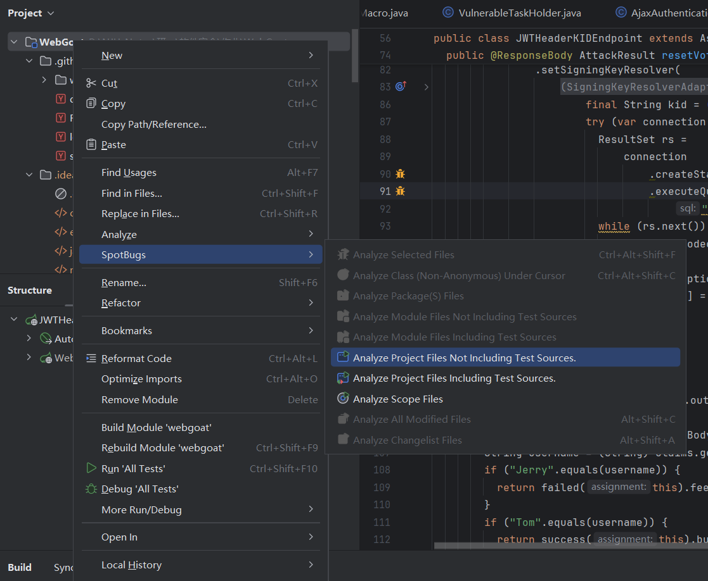

### 题目


### 操作步骤

1、**为IDEA下载分析工具的插件**

[IntelliJ Tutorial · find-sec-bugs/find-sec-bugs Wiki · GitHub](https://github.com/find-sec-bugs/find-sec-bugs/wiki/IntelliJ-Tutorial)


2、**下载项目代码**

```bash
git clone https://github.com/WebGoat/WebGoat.git
```

3、**使用maven下载依赖并构建**


4、**使用SpotBugs工具分析缺陷**



5、**查看分析结果**


6、**验证问题**

根据提示这里可能存在SQL注入的问题


使用postman发送请求


可以看到成功输出了两个表的内容

7、**修复缺陷**

对此处代码进行修改，通过使用PreparedStatement代替原本的Statement，通过stmt.setString(1, accountName);设置参数，避免了SQL注入的问题。


再次测试发现成功阻止了SQL注入。


```java
PreparedStatement stmt = connection.prepareStatement(sql) // 需要注意初始化时的参数否则会遭遇神秘报错feature not supported https://stackoverflow.com/questions/56790482/feature-not-supported-error-when-using-the-method-first-of-resultset
PreparedStatement stmt = connection.prepareStatement(sql, ResultSet.TYPE_SCROLL_INSENSITIVE, ResultSet.CONCUR_READ_ONLY); // done
```

